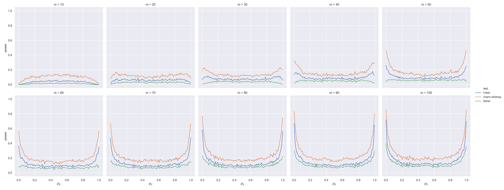
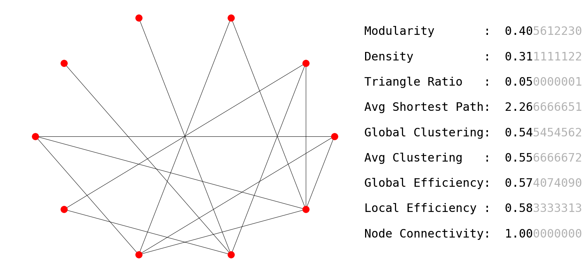
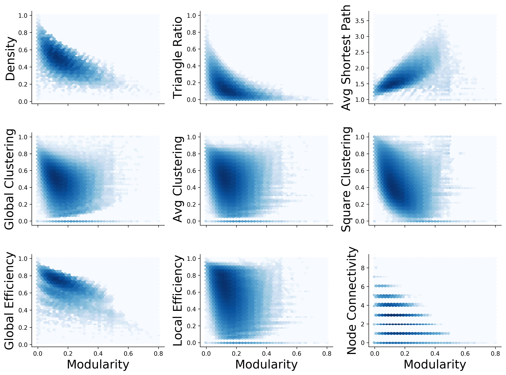
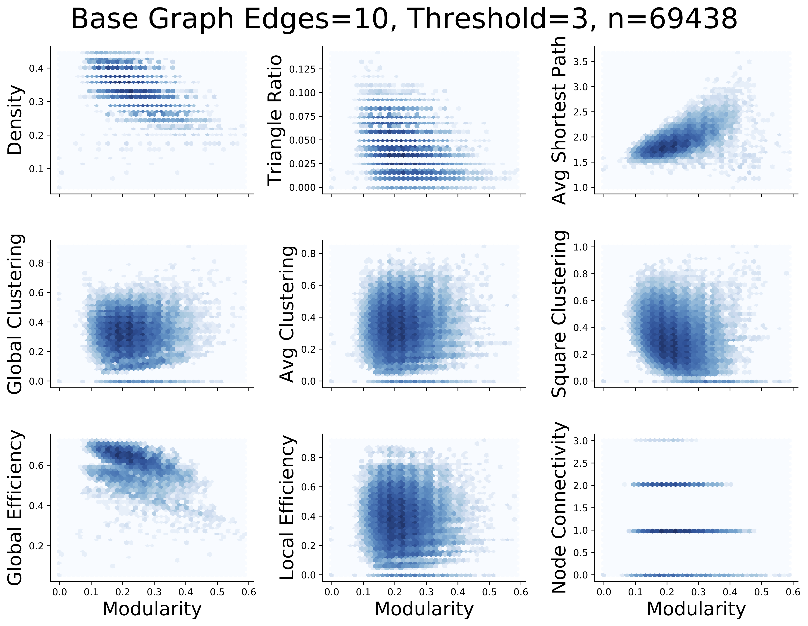
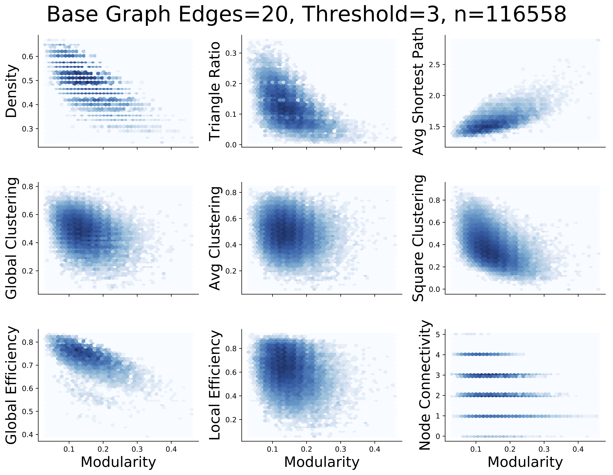
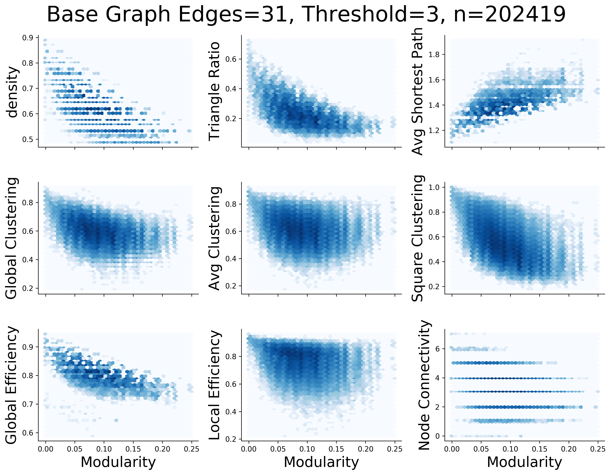
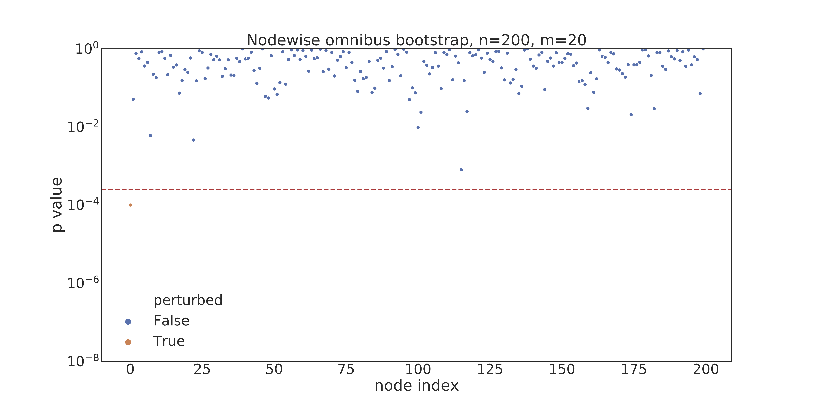
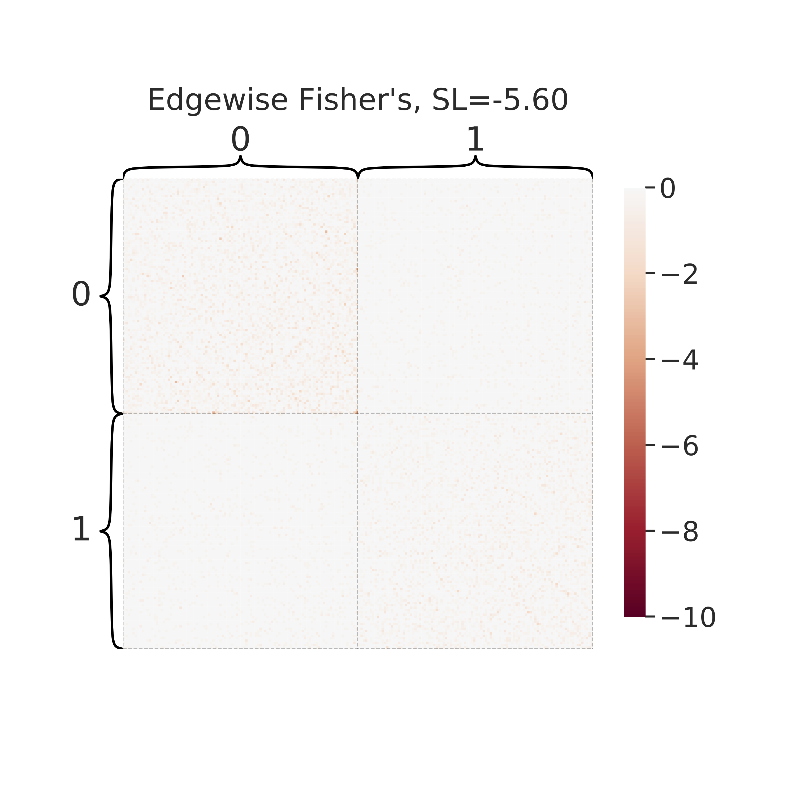

Connectomics Do's and Don'ts (DnDs)
===================================

Experiments showing the "Do's and Don'ts" of connectome analysis

If using notebooks please label with initials as described, put in `experiments`

When we have code we trust for an experiment let's put it in `experiments` folder

If there are utility funcs that are shared across experiment, put them in `src` (likely
`src.utils`).

The Plan
--------
### simulation 1

2 populations of IE graphs, each with probability matrix P_i

Let b be a vector of length n linearly increasing over the range [eps, 1-eps]

Let P1 be a grid determined by P1, i.e. P1(1,1)=b(1), P1(1,2)=b(2), ...

Let P2(u,v) = P1(u,v) + delta if P1(u,v) < 0.5 or
    P2(u,v) = P1(u,v) - delta if P1(u,v) \geq 0.5

for k iterations:
1. sample m IE graphs from P1 and also m from P2.
2. on each edge, run a T-test, Mann Whitney U Test, and Fisher's exact test.

make the following plots:
1. Power versus the elements of P1
2. Type 1 Error versus the elements of P2

lesson 1: don't use t-test, for binary graphs use wilcoxon.

[Demonstration Notebook](https://github.com/neurodata/dos_and_donts/blob/master/experiments/experiment_1/VG-experiment1-power.ipynb) | 
[Power Simulation](https://github.com/neurodata/dos_and_donts/blob/master/experiments/experiment_1/simulation_power.py) | 
[Type 1 Error Simulation](https://github.com/neurodata/dos_and_donts/blob/master/experiments/experiment_1/simulation_type1.py) | 
[Simulation Results](https://github.com/neurodata/dos_and_donts/blob/master/experiments/experiment_1/VG-experiment1-plotting.ipynb)

#### Power

#### Type 1 Error

### simulation 2

essentially the same, but this time, edges are in [-1, 1], to correspond to correlations one could estimate.

A(u,v) | y=0 ~ N(0, sig), with sig set so that 99% of the distribution lives between -1 and 1
A(u,v) | y=1 ~ N(D(u,v), sig), truncated to discard anything below -1 or above +1

basically, i want some of the edge distributions to be super clearly non-gaussian, 
because they are close to -1 or close to +1

now, run the same analyses as before, 
and generate the same plots as before.
add plot showing different distributions, a la, to highlight that when correlations are close to the boundaries, they cannot be gaussian unless their variance is trivially small.
image.png

lesson 2: don't use t-test for correlation graphs, use wilcoxon.

### simulation 3

same as sim 1, but now assume we have a 2-block SBM for each class,
where only one block is different for the two classes, 
and assume an affinity model, eg

A | y=0 ~ SBM(B), where b_11 = b - eps, b_22 = 0.5,  and b_ij = 0.1
A | y=1 ~ same distribution, except b_11 = b - eps, say eps = 0.05 or so.
let b = 0.5, to start.

now, make m=10.

plot 1: same heatmaps as above
plot 2:
beeswarm of log p-values using t-test for each of the 4 blocks.
beeswarm of log-p-values using wilcox for each of the 4 blocks.

the "right" thing to do here is to test whether blocks are different,
and the most powerful test depends on b.

so, plot power vs b as b ranges from eps to 1-eps for fixed m=10 and n=100
when b is close to 0 or 1, wilcox wins,
when b is close to 0.5, t-test wins by a little bit.

lesson 3: model the blocks rather than edges, use wilcox rather than t-test, in general, for binary graphs.

### simulation 4

as exact thing as sim 3, except now A(uv) ~ Poison (P(u,v)), rather than Bernoulli(P(u,v))

lesson 4: same, use wilcox, rather than t-test

### simulation 5

consider the datasaurus: https://www.autodeskresearch.com/publications/samestats

let's do the same thing with a graph,
so, generate a graph, and compute modularity (say),
then, add/remove nodes/edges to preserve modularity.

plot a 2D layout of m different graphs with the exact same modularity.

lesson 5: don't use single graph metrics, they aren't that informative

### simulation 6

sample m=100 ER graphs.
compute the other top 10 graph metrics that people use in connectomics (i'm not sure what they are, clustering coefficient, prob 10 from here: https://sites.google.com/site/bctnet/measures/list
that happen to be in networkx

for m=100, sample y_i ~ N(0,1)  + modularity_i

scatterplot the correlation between each of the 10 graph stats and y
compute rho for each, and find 1 for which p < 0.05
or rho > eps, so they look correlated.

lesson 6: when any given metric is correlated with y, so are many other metrics, 
so making up a story that a particular property of the brain "explains" a given phenotypic property of a person is spurious reasoning.

#### All graphs

#### Thresholding

### simulation 7

pop 1 is a DC-SBM, 2 block, affinity
the difference between it and pop 2 is that 
for pop 1, the promiscuity parameter is 0.5 for all vertices
and for pop 2, vertex 1 has a different promiscuity parameter

similar analysis as before, but this time, 
we compare doing things "edge-wise" to doing things "node wise"
that is, we jointly embed (using mase or omni)
and test whether each vertex is different.

plots: 
heatmap of edge-wise p-values on log scale
heatmap of node-wise p-values on a log scale

to get node-wise p-values, we embed each graph into 2D.
then we run 2-way mgc on each vertex to get a p-value.
that gives us a p-value vector of length n
now, take the outer product of that vector with itself, to get an n x n matrix
and take the square root of that matrix.
essentially, this should look like the edge-wise p-value map "smoothed" by vertices.

lesson 7: model the nodes, not the edges

#### Node wise p-values

#### Edgewise p-values

### simulation 8

pop 1 is m samples from same SBM as before.
for pop 2, for block_11, we add N(0,sig) noise to each element of P_uv
this means that each block in both populations has the same expected probability.
but there are a number of edges in the first population that are different.
make sig small enough so that for m=100 samples, none of the edges are significant, even when using wilcox.

also, when testing the blocks, none of them will be significant.

but, if we use multivariate 2-way mgc on each block,
the p-value is really small for block_11, and really large for the other blocks.

again, we plot heatmaps using edgewise wilcoxon log pvalues, 
and block wise (ignoring vertex alignment) log pvalues
and blockwise multivariate log pvalues

lesson: use multivariate stats as appropriate

[Notebook](https://github.com/neurodata/dos_and_donts/blob/master/experiments/experiment_8/experiment_8.ipynb)

#### Edge wise T test

#### Block wise T test

#### Block wise MGC

### sim 9

given the 4 block model from TT PNAS paper, 
cluster using LSE, 
cluster using ASE, 
find different answers.
plot adjacency matrix sorted by each clustering approach

what do we do instead? 
HSBM?

### sim 10

for M subjects, for T time steps
sample x_(m,t) ~ N(0,Sigma)
have node 1 and 2 correlated, and 2 and 3 correlated, but not 1 and 3
estimate correlation matrix

y_m = gaussian noise + correlation of x_m(v1,v2)

look at correlation between y_m and x_m(v1,v3)
it will be high

repeat the same, but replace correlation matrix with inverse correlation matrix,
the correlation between y and inverse-correlation of x_m(v1,v3) will be small.

lesson: use inverse correlation

### sim 11

something on time-varying connectomes:
for each M subject, sample 10 timeseries from an AR process.
compute dynamic connectomes
for each coonnectome, compute discriminability and show that they are discriminable 
even though generative process is random

lesson: dynamic connectomes are nonsense

### fin

Project Organization
------------

    ├── LICENSE
    ├── Makefile           <- Makefile with commands like `make data` or `make train`
    ├── README.md          <- The top-level README for developers using this project.
    ├── data
    │   ├── external       <- Data from third party sources.
    │   ├── interim        <- Intermediate data that has been transformed.
    │   ├── processed      <- The final, canonical data sets for modeling.
    │   └── raw            <- The original, immutable data dump.
    │
    ├── docs               <- A default Sphinx project; see sphinx-doc.org for details
    │
    ├── models             <- Trained and serialized models, model predictions, or model summaries
    │
    ├── notebooks          <- Jupyter notebooks. Naming convention is a number (for ordering),
    │                         the creator's initials, and a short `-` delimited description, e.g.
    │                         `1.0-jqp-initial-data-exploration`.
    │
    ├── references         <- Data dictionaries, manuals, and all other explanatory materials.
    │
    ├── reports            <- Generated analysis as HTML, PDF, LaTeX, etc.
    │   └── figures        <- Generated graphics and figures to be used in reporting
    │
    ├── requirements.txt   <- The requirements file for reproducing the analysis environment, e.g.
    │                         generated with `pip freeze > requirements.txt`
    │
    ├── setup.py           <- makes project pip installable (pip install -e .) so src can be imported
    ├── src                <- Source code for use in this project.
    │   ├── __init__.py    <- Makes src a Python module
    │   │
    │   ├── data           <- Scripts to download or generate data
    │   │   └── make_dataset.py
    │   │
    │   ├── features       <- Scripts to turn raw data into features for modeling
    │   │   └── build_features.py
    │   │
    │   ├── models         <- Scripts to train models and then use trained models to make
    │   │   │                 predictions
    │   │   ├── predict_model.py
    │   │   └── train_model.py
    │   │
    │   └── visualization  <- Scripts to create exploratory and results oriented visualizations
    │       └── visualize.py
    │
    └── tox.ini            <- tox file with settings for running tox; see tox.testrun.org

--------

<small>Project based on the <a target="_blank" href="https://drivendata.github.io/cookiecutter-data-science/">cookiecutter data science project template</a>. #cookiecutterdatascience</small>

